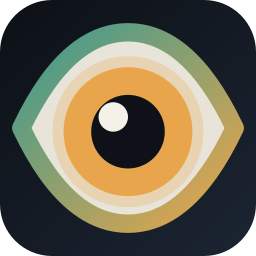
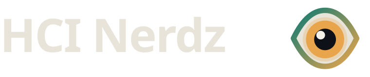

  

  

---

<strong>Discoverable surfaces. Lower cognitive tax.</strong>

HCI and UI/UX innovation -- graphical interfaces, interaction design, and product representation that respect how minds work.

<a href="https://hci-nerdz.github.io/">Site</a> &middot;
<a href="https://hci-nerdz.github.io/docs/">Docs</a> &middot;
<a href="https://hci-nerdz.github.io/news/">News</a>

Shell and CLI standards live at <a href="https://github.com/openshellorg">openshellorg</a>.

---

### Logo assets

| File | Use |
| --- | --- |
| [`assets/logo-mark.svg`](assets/logo-mark.svg) | Org mark (padded rounded square, vector) |
| [`assets/logo-mark-512.png`](assets/logo-mark-512.png) | Org avatar upload (512px) |
| [`assets/logo-wordmark.svg`](assets/logo-wordmark.svg) | Wordmark (transparent eye) |

The site header uses a transparent eye (`HCI-Nerdz.github.io` `public/logo-mark.svg`), not this padded tile.

Upload `logo-mark-512.png` at [Organization profile settings](https://github.com/organizations/HCI-Nerdz/settings/profile).

### What we own

| Layer | HCI Nerdz |
| --- | --- |
| Surfaces | Themes, previews, dialogs, IDE chrome, desktop metaphors |
| Discoverability | Severity, settings truth, discoverability, product representation |
| Attention | Tools that do not spend your brain for you |

### Partner organizations

| Org | Focus |
| --- | --- |
| [OpenShellOrg](https://openshellorg.github.io/) &middot; [Docs](https://openshellorg.github.io/docs/) &middot; [GitHub](https://github.com/openshellorg) | How CLIs and shells speak and compose |
| [DevCentr](https://devcentr.org/) &middot; [Docs](https://docs.devcentr.org/) &middot; [GitHub](https://github.com/dev-centr) | Environments, orchestration, toolchain management |
| [antora-supplemental](https://github.com/antora-supplemental) &middot; [Valentus](https://github.com/antora-supplemental/valentus-theme) | AsciiDoc / Antora publishing UX |
| [dlang-supplemental](https://github.com/dlang-supplemental) | D libraries and native tooling |
| [formatte](https://github.com/formatte) | Formatting ecosystem |
| [LinxPhotos](https://github.com/LinxPhotos) | Photo / portfolio hosting |
| [FoodTruckNerdz](https://github.com/FoodTruckNerdz) | Product domain (food trucks) |
